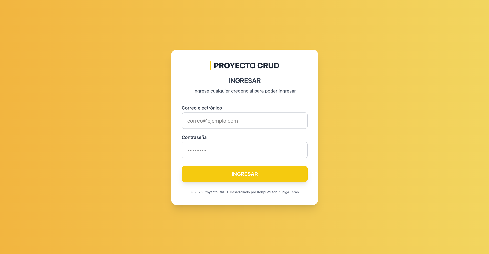
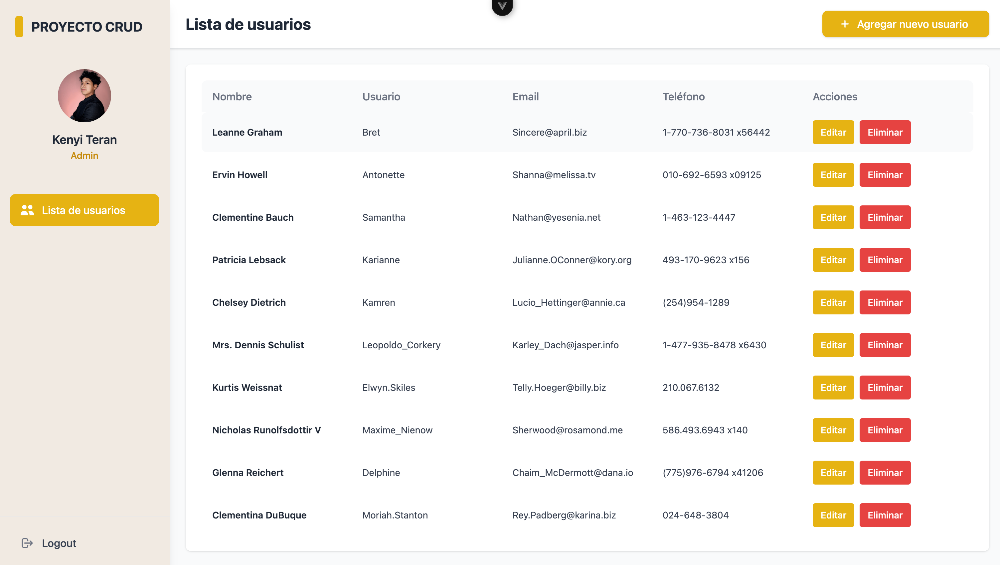

# 🧩 proyectoCRUD

Aplicación CRUD desarrollada con Vue 3, Pinia, Vue Router y Tailwind CSS. Permite gestionar usuarios a través de una interfaz moderna, responsiva y fácil de usar.

---

## 🔐 Login

Para ingresar a la aplicación **no es necesario usar credenciales reales**.  
Solo asegúrate de que el campo de correo electrónico tenga una estructura válida (ej. `usuario@ejemplo.com`) y que la contraseña no esté vacía.



## 👥 Lista de usuarios
Una vez dentro, accederás a la vista principal donde se muestra la **lista de usuarios**.  Desde aquí puedes **agregar**, **editar** o **eliminar** usuarios de forma rápida y sencilla.



---

## 🚀 Funcionalidades

- Lista de usuarios con opción de editar, agregar y eliminar
- Modal para el manejador de rutas o vistas
- Almacenamiento simulado con JSONPlaceholder
- Estado global con Pinia
- Estilos responsivos con Tailwind CSS
- Login simulado sin autenticación real

---

## 💻 Requisitos para desarrollo

### Recommended IDE Setup

[VSCode](https://code.visualstudio.com/) + [Volar](https://marketplace.visualstudio.com/items?itemName=Vue.volar) (and disable Vetur).

## Customize configuration

See [Vite Configuration Reference](https://vite.dev/config/).

## Project Setup

```sh
npm install
```

### Compile and Hot-Reload for Development

```sh
npm run dev
```

### Compile and Minify for Production

```sh
npm run build
```

### Lint with [ESLint](https://eslint.org/)

```sh
npm run lint
```

## 🧱 Tecnologías

- Vue 3

- Pinia

- Vue Router

- Tailwind CSS

- Axios

- Vite

## 👨‍💻 Autor
Desarrollado por Kenyi Wilson Zuñiga Teran — 2025